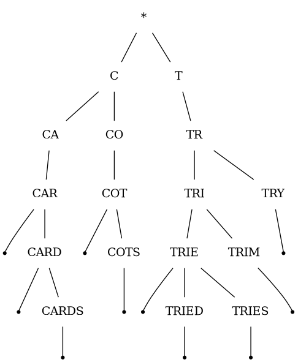

# Trie

Trie is a type of a [[Tree|tree]] that is used for storing characters

```plantuml
@startdot

graph a {
	node [shape=plaintext]
	"*" [label="*" ]
	"*1" [label="*" shape=point]
	"*2" [label="*" shape=point]
	"*3" [label="*" shape=point]
	"*4" [label="*" shape=point]
	"*5" [label="*" shape=point]
	"*6" [label="*" shape=point]
	"*7" [label="*" shape=point]
	"*8" [label="*" shape=point]
	"*9" [label="*" shape=point]
	"*10" [label="*" shape=point]
	
	"*" -- {C T}
	C -- {CA CO}
	CA -- CAR
	CAR -- {"*1" CARD}
	CARD -- {"*2" CARDS}
	CARDS -- "*3"
	CO -- COT
	COT -- {"*4" COTS}
	COTS -- "*5"
	T -- TR
	TR -- {TRI TRY}
	TRY -- "*6"
	TRI -- {TRIE, TRIM}
	TRIM -- "*7"
	TRIE -- {"*8" TRIED TRIES}
	TRIED -- "*9"
	TRIES -- "*10"
}

@enddot
```