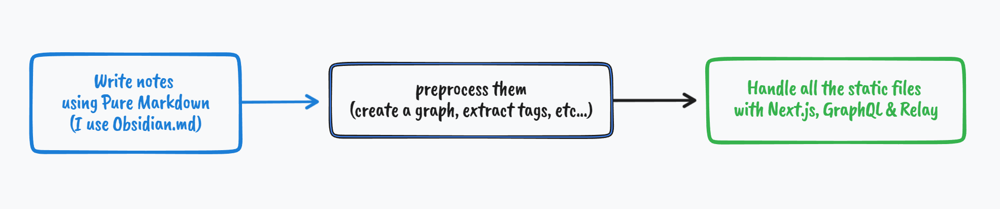

# My digital garden

Take a look here: [artialex.github.io](https://artialex.github.io)

## Architecture

### 1. Markdown notes

Notes are the _core_ of the website. I write them using [Obsidian](https://obsidian.md/). They are located inside `public/notes` folder

### 2. Helpful scripts

Convenient note scripts help to check something

- `npm run preprocess`: Creates graph like data structure which helps with tags and moving between pages

### 3. Next.js application

With the help of `Next.js` I can create a static pages that are handled by GutHub Pages.
I use [unified](https://github.com/unifiedjs/unified) to render markdown and a number of plugins (wiki-links, frontmatter, etc.)

- _Insertions_ are various additional components that add some interactivity to the website, for example:
  - [x] [Eight Queens puzzle](https://alextheartisan.github.io/?id=Backtracking%20search)
  - [ ] Dot product
  - [ ] Bezier curves
  - [ ] Sine & Cosine
- [] Code highlighting

## Notes

- `develop` branch has the source code
- `master` branch has gh-pages build (via GitHub Actions)

## Other GH projects that help to manage ZettelKasten notes

- [mdzk](https://github.com/mdzk-rs/mdzk)

## TODO

- [ ] Add omnibox for searching
- [ ] Fix code highlighting
- [ ] Add animation & Transitions between pages?
- [ ] Better visuals for TODO labels
- [ ] #read tags
- [ ] Show random note functionality
- [ ] Linters
  - [ ] JS/TS
  - Markdown
  - Latex?
  - English prose & grammar
- [x] LinkVault
- [ ] Hemingway editor features?
- [ ] Graph view
- [ ] Andy Matuschak view (horizontal)
- [ ] Tiddly wiki view (vertical)
- [ ] Composed view
- [ ] icons for links like github, mdn, etc...
- [ ] icons for tags
- [ ] error page
- [ ] Why I use LaTeX?
